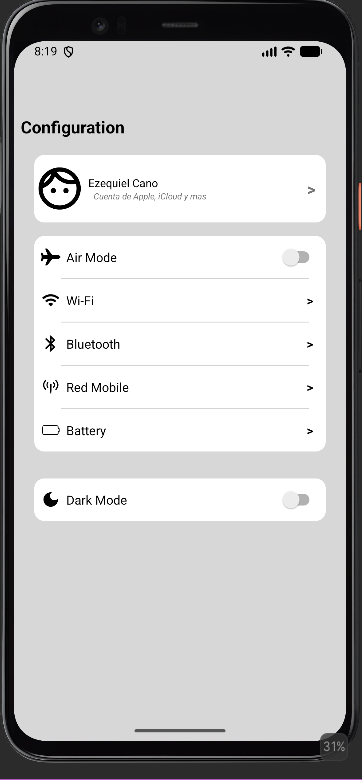
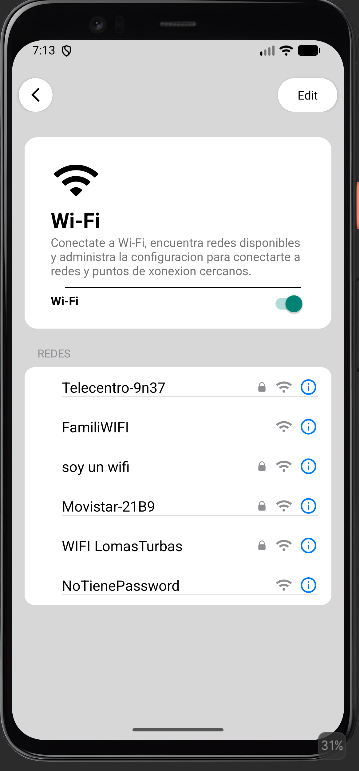
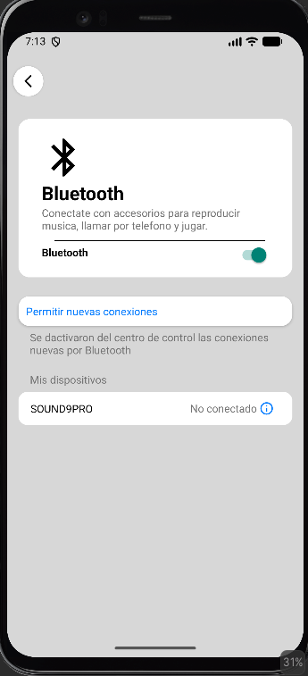
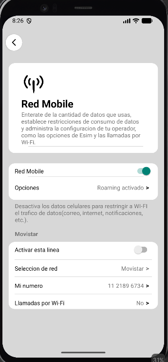
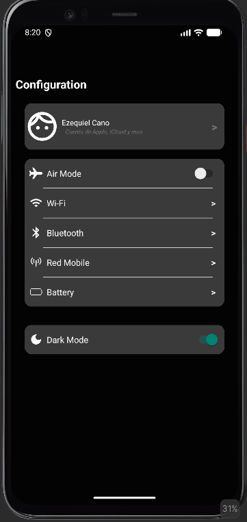
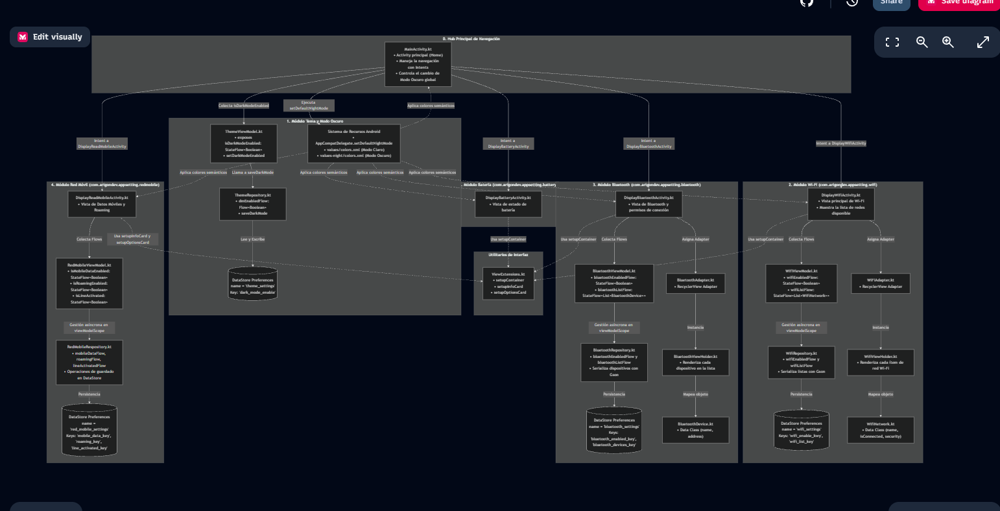

# ⚙️ appSetting — Android Settings Clone

Aplicación nativa de Android inspirada en la interfaz de **Ajustes de iOS**, desarrollada con **Kotlin** y Android SDK.

El proyecto tiene fines educativos y de demostración, aplicando conceptos de arquitectura Android moderna, separación de responsabilidades, persistencia local y programación reactiva.

---

## 📱 Capturas

### 🏠 Pantalla principal



### 📶 Wi-Fi



### 📡 Bluetooth



### 📱 Red móvil



### 🔋 Batería


### 🌙 Modo oscuro



### 🌙 Mapa del proyecto actualmente (03/09)


---

## 🚀 Características

### 📶 Wi-Fi

* Visualización de redes Wi-Fi.
* Lista dinámica mediante `RecyclerView`.
* `Adapter` y `ViewHolder`.
* Agregado de redes mediante diálogo personalizado.
* Configuración del estado del Wi-Fi.
* Persistencia de configuraciones.

### 📡 Bluetooth

* Visualización de dispositivos Bluetooth.
* Lista de dispositivos mediante `RecyclerView`.
* Gestión del estado del Bluetooth.
* Persistencia de configuraciones.

### 📱 Red móvil

* Información de la red celular.
* Información de la compañía telefónica.
* Configuración de datos móviles.
* Configuración de roaming.
* Activación/desactivación de la línea.
* Diálogos personalizados.
* Persistencia de estados.

### 🔋 Batería

* Pantalla dedicada a la información de batería.
* Visualización del estado general del dispositivo.

### 🌙 Modo oscuro

* Soporte para tema claro y oscuro.
* Persistencia de la preferencia del usuario.
* Implementación mediante `ViewModel` y `Repository`.
* Recursos específicos para modo nocturno.

---

## 🏗️ Arquitectura

El proyecto utiliza una arquitectura basada en **MVVM (Model-View-ViewModel)** junto con el patrón **Repository**.

```text
┌──────────────────────┐
│         View         │
│      Activities      │
│        XML UI        │
└──────────┬───────────┘
           │
           ▼
┌──────────────────────┐
│      ViewModel       │
│  Estado de pantalla  │
│      StateFlow       │
└──────────┬───────────┘
           │
           ▼
┌──────────────────────┐
│     Repository       │
│ Lógica de acceso a   │
│       datos          │
└──────────┬───────────┘
           │
           ▼
┌──────────────────────┐
│     DataStore        │
│   Persistencia local │
└──────────────────────┘
```

### Principios utilizados

* Separación de responsabilidades.
* MVVM.
* Repository Pattern.
* Unidirectional Data Flow (UDF).
* Programación reactiva.
* Estado de UI mediante `StateFlow`.
* Corrutinas.
* Persistencia local.

---

## 🛠️ Tecnologías

| Tecnología                | Uso                    |
| ------------------------- | ---------------------- |
| **Kotlin**                | Lenguaje principal     |
| **Android SDK**           | Desarrollo Android     |
| **XML**                   | Interfaces de usuario  |
| **View Binding**          | Acceso seguro a vistas |
| **ConstraintLayout**      | Diseño de interfaces   |
| **Material Components**   | Componentes visuales   |
| **RecyclerView**          | Listas dinámicas       |
| **ViewModel**             | Gestión del estado     |
| **Kotlin Coroutines**     | Operaciones asíncronas |
| **Flow / StateFlow**      | Programación reactiva  |
| **Preferences DataStore** | Persistencia local     |

---

## 📂 Estructura del proyecto

```text
app/src/main/java/com/arigondev/appsetting/
│
├── MainActivity.kt
├── ViewExtensions.kt
│
├── battery/
│   └── DisplayBatteryActivity.kt
│
├── bluetooth/
│   ├── DisplayBluetoothActivity.kt
│   ├── BluetoothViewModel.kt
│   └── BluetoothRepository.kt
│
├── wifi/
│   ├── DisplayWifiActivity.kt
│   ├── WifiViewModel.kt
│   ├── WifiRepository.kt
│   ├── WifiAdapter.kt
│   └── WifiViewHolder.kt
│
└── redmobile/
    ├── DisplayReadMobileActivity.kt
    ├── RedMobileViewModel.kt
    └── RedMobileRespository.kt
```

---

## 💾 Persistencia

La aplicación utiliza **Jetpack Preferences DataStore** para almacenar configuraciones localmente en el dispositivo.

Entre los estados persistidos se encuentran:

* Estado del Wi-Fi.
* Redes Wi-Fi agregadas.
* Estado del Bluetooth.
* Configuración de datos móviles.
* Estado del roaming.
* Estado de la línea móvil.
* Preferencia del tema claro/oscuro.

---

## 📦 Instalación

### Clonar el repositorio

```bash
git clone https://github.com/canoezequiel7k-sys/appSetingsStyleIphone.git
```

### Abrir el proyecto

1. Cloná el repositorio.
2. Abrí la carpeta del proyecto con **Android Studio**.
3. Esperá a que Gradle sincronice las dependencias.
4. Conectá un dispositivo Android o iniciá un emulador.
5. Ejecutá la aplicación.

### Requisitos

* Android Studio.
* JDK compatible con la versión del proyecto.
* Android SDK.
* Android 7.0 (API 24) o superior.

---

## 🎯 Objetivo del proyecto

El objetivo principal de **appSetting** es practicar y demostrar conceptos de desarrollo Android utilizando Kotlin, especialmente:

* Arquitectura MVVM.
* Manejo de estados.
* Corrutinas y Flows.
* ViewModel.
* Repository Pattern.
* DataStore.
* RecyclerView.
* Componentización de interfaces.
* Diseño de interfaces inspirado en sistemas móviles modernos.

---

## 🔮 Próximas mejoras

Algunas funcionalidades que pueden incorporarse en futuras versiones:

* [ ] Más configuraciones del dispositivo.
* [ ] Animaciones y transiciones.
* [ ] Mejoras visuales.
* [ ] Más opciones de personalización.
* [ ] Tests unitarios.
* [ ] Tests instrumentados.
* [ ] Mejoras de accesibilidad.

---

## 👨‍💻 Autor

**ArigonDev**

Proyecto desarrollado con fines educativos y de aprendizaje de desarrollo Android.

---

## 📄 Licencia

Este proyecto fue creado con fines educativos.
